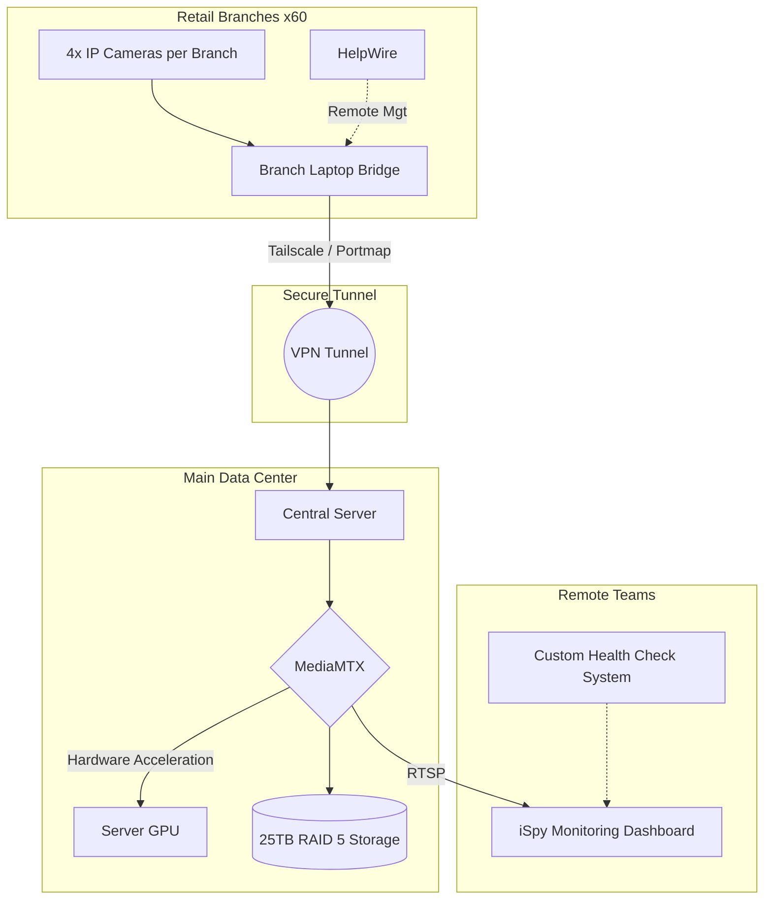

# Enterprise VMS Architecture: Cross-Border Retail Monitoring 🎥🌍

A custom, highly scalable Video Management System (VMS) architected to provide centralized, zero-latency monitoring for 60+ retail branches. This system replaced expensive, inefficient cloud-based vendor solutions with a robust, self-hosted infrastructure.

## 🛠️ Tech Stack & Infrastructure
* **Core Routing & Streaming:** MediaMTX, RTSP Protocols
* **Monitoring & Diagnostics:** iSpy, Custom Health Check System
* **Networking & Remote Access:** Tailscale, Portmap, HelpWire
* **Hardware & Storage:** Custom Server Build, GPU Hardware Acceleration, 25TB RAID 5

## 🏗️ The Architecture
**The Problem:** The existing setup relied on basic cameras that were inefficient and prone to failure. Enterprise alternatives required massive, recurring cloud licensing fees. 

**The Solution:** I deployed a localized-to-centralized hybrid bridge.
1. **The Local Bridge:** Upgraded all 60+ branches to utilize 4 dedicated IP cameras, using the existing branch laptops as localized network bridges.
2. **Remote Management:** Integrated HelpWire into the branch laptops, allowing me to remotely adjust, maintain, and troubleshoot the local bridge seamlessly.
3. **The Tunnel:** Implemented Tailscale and Portmap to create secure tunnels from the remote branches directly to the central server.
4. **Central Routing:** MediaMTX handles the heavy lifting of securely routing hundreds of concurrent RTSP streams.
5. **Cross-Border Monitoring:** The remote monitoring team accesses live feeds via iSpy.

### System Flowchart

🧠 Engineering Challenges & Hardware Limits

Building a system this size required solving several severe hardware bottlenecks:

    GPU Hardware Acceleration: Routing over 200+ continuous live streams caused critical CPU thermal throttling. I deeply optimized the MediaMTX configurations to offload the video processing to the server's powerful GPU, stabilizing the system temperatures immediately.

    Complex RAID Integration: To retain months of high-definition footage, I built a 25TB RAID 5 array. Because the motherboard BIOS did not natively support this specific RAID configuration, I had to manually engineer and force the setup to ensure zero data loss and maximum read/write uptime.

    Failure Point Diagnostics: A multipoint system creates multiple points of failure. Instead of leaving the remote monitoring team to guess why a camera dropped, I engineered a custom Health Check System that allows them to easily ping and diagnose the exact point of failure across the international network.

Status: Deployed and actively managing 240+ cameras across international borders with near-zero recurring software costs.

